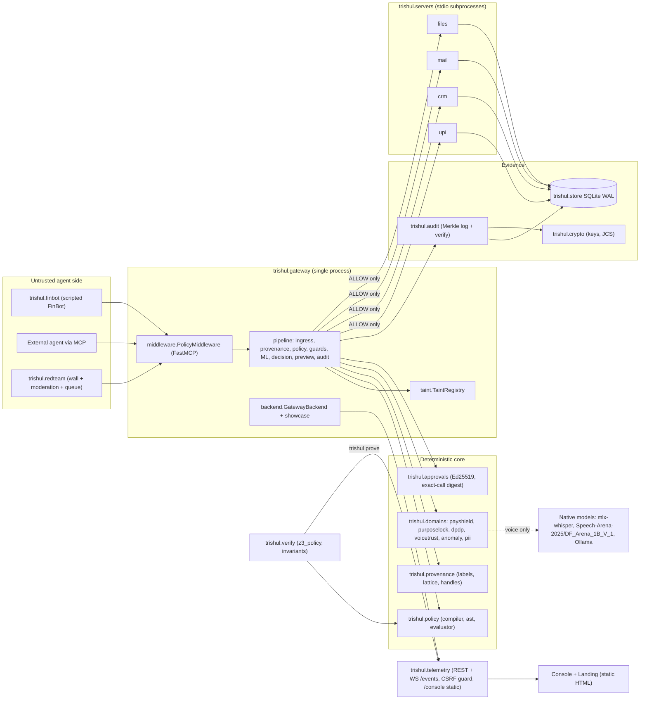

# Architecture

Key properties
- One decision core (`trishul.policy` + `trishul.gateway.pipeline`) is shared by the gateway, the
  benchmarks (`trishul.bench`, in-process) and the Z3 translation (`trishul.verify.z3_policy`).
- Tool servers run as stdio subprocesses of the gateway (`trishul.gateway.server_main`) and share the
  WAL SQLite file; the gateway is the only network-facing entry (MCP :8788, REST/WS :8787).
- ML (voice detector, anomaly/PII signals) can only raise a decision (invariant I2), so
  `trishul ml off` never weakens rule-based denial. Voice spoof scoring is the exception in
  practice: see limitations in `docs/threat-model.md`.
- OFF mode routes calls to the isolated `demo_off` namespace, audited with `mode:"off"`.
- Native vs Docker: models always run natively; the container only holds gateway, tool servers,
  SQLite volume and static UI.
